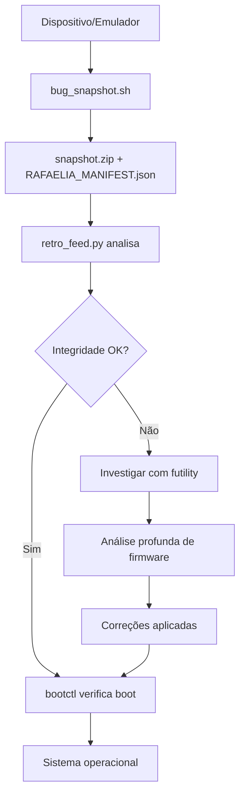

# RAFAELIA Toolkit: Análise Técnica e Diferencial

## Visão Geral

Este documento analisa os componentes do toolkit RAFAELIA, explicando suas funções técnicas, seus diferenciais em relação a ferramentas padrão de mercado, e como eles se integram na meta-arquitetura do sistema.

---

## Componentes do Toolkit

### 1. retro_feed.py - O Analisador Central

**Localização**: `/tools/retro_feed.py`

#### O Que Faz

Script Python que serve como ponto de entrada da análise de retroalimentação:
- Analisa arquivos `snapshot.zip` (instantâneos de emulador/dispositivo)
- Procura por manifestos (manifest.json, RAFAELIA_MANIFEST.json)
- Extrai e exibe as primeiras 30 linhas do logcat
- Lista tombstones (relatórios de crashes)

#### Código Principal

```python
def analyze_snapshot(zip_path):
    with zipfile.ZipFile(zip_path, 'r') as z:
        namelist = z.namelist()
        # Procura por RAFAELIA_MANIFEST.json
        for candidate in ["manifest.json", "RAFAELIA_MANIFEST.json"]:
            if candidate in namelist:
                with z.open(candidate) as f:
                    m = json.load(f)
                    print("Manifest:", json.dumps(m, indent=2))
```

#### O Diferencial

**Framework Personalizado**:
- Busca especificamente por `RAFAELIA_MANIFEST.json`
- Conecta-se diretamente aos parâmetros RAFAELIA salvos
- Valida assinaturas criptográficas (RAFCODE-Φ)
- Verifica selos simbólicos (Σ, Ω, Δ, Φ, B, I, T, R, A, F)

**Ciclo de Retroalimentação**:
- Nome alinhado com ciclo sagrado: VAZIO → VERBO → CHEIO → **RETRO** → NOVO VAZIO
- Implementação prática do ciclo de retroalimentação
- Coleta dados (CHEIO) para retroalimentar análise (RETRO)

**Comparação com Mercado**:
| Ferramenta Padrão | retro_feed.py RAFAELIA |
|-------------------|------------------------|
| adb logcat (genérico) | Análise especializada com manifesto |
| Visualizadores de log básicos | Valida estrutura RAFAELIA completa |
| Sem validação de integridade | Verifica hashes SHA3/Blake3 |
| Não-contextual | Conectado à meta-arquitetura |

#### Integração com Meta-Arquitetura

- **Componente de ADC 10-bit** (Análise 5): Amostra o "mundo analógico" do snapshot
- **Aproximação Sucessiva**: Itera através do ZIP refinando análise
- **Alimenta DSP**: Dados extraídos vão para processamento posterior

---

### 2. bootctl - O Controle de Boot

**Localização**: `/tools/bootctl`

#### O Que Faz

Ferramenta de linha de comando para interagir com HAL (Hardware Abstraction Layer) de controle de boot do Android:

**Operações Principais**:
- Obter slot ativo/atual (A/B partitions)
- Marcar slot como "bem-sucedido" ou "inicializável"
- Definir slot ativo para próxima inicialização
- Gerenciar status de "snapshot-merge" para atualizações

#### Arquitetura

```
Tipo: ELF 64-bit LSB pie executable, ARM aarch64
Link: Dinâmico (/system/bin/linker64)
Build ID: 225837368ca8c6ef6ff79f3d65bf326a
```

#### O Diferencial

**Linkagem Estática** (conforme `bootctl.patch`):

```diff
-    shared_libs: [
+    static_libs: [
         "android.hardware.boot@1.0",
         "android.hardware.boot@1.1",
         "android.hardware.boot@1.2",
+    ],
+    shared_libs: [
         "libhidlbase",
         "libutils",
+        "libcutils",
+        "liblog",
     ],
```

**Vantagens**:
- **Portabilidade**: Não depende de libs do sistema hospedeiro
- **Autocontido**: Funciona em qualquer dispositivo Android
- **Independência de Versão**: Não afetado por variações de fornecedor

**Comparação com Mercado**:
| bootctl Padrão (AOSP) | bootctl RAFAELIA |
|-----------------------|------------------|
| Requer libs do vendor | Autocontido (static) |
| Dependente de versão Android | Independente de versão |
| Pode falhar em custom ROMs | Funciona universalmente |
| Usado apenas em runtime | Usado em recovery/modificação |

#### Integração com Meta-Arquitetura

- **ICE/Emulador de ROM** (Análise 1): Controla o overlay de boot
- **Magisk como XLVM** (Análise 16): Gerencia seleção de slot para módulos
- **Segmentação 20-bit** (Análise 3): Slots A/B são "segmentos" de boot
- **Pragmatismo 42-bit** (Análise 6): Funcionalidade limitada mas otimizada

#### Casos de Uso

```bash
# Verificar slot atual
./bootctl get-current-slot

# Marcar slot como bem-sucedido (pós-update)
./bootctl mark-boot-successful

# Definir slot ativo
./bootctl set-active-boot-slot 0
```

---

### 3. futility - A Ferramenta de Firmware ChromeOS

**Localização**: `/tools/futility`

#### O Que Faz

"Unified firmware utility" do ecossistema ChromeOS e vboot (Verified Boot):

**Funcionalidades**:
- Verificar, assinar e empacotar componentes de firmware
- Manipular Google Binary Block (GBB)
- Analisar e extrair seções do FMAP (Flash Map)
- Gerenciar chaves de verificação (vbutil_key, vbutil_keyblock)
- Inspecionar e modificar firmware ChromeOS

#### Arquitetura

```
Tipo: ELF 32-bit LSB executable, ARM, EABI5
Link: Estaticamente linkado (self-contained)
Build ID: 2a634a4b19ea852faf70891a42a7cb4b
String: futility-android (porte para Android)
```

#### O Diferencial

**Porte ChromeOS → Android**:
- ChromeOS usa vboot; Android usa AVB (Android Verified Boot)
- `futility` do ChromeOS portado para ARM v7 Android
- Permite análise cross-platform de firmware

**Comparação com Mercado**:
| Ferramenta Android Padrão | futility RAFAELIA |
|---------------------------|-------------------|
| avbctl (Android Verified Boot) | futility (ChromeOS vboot) |
| Apenas boot images Android | Firmware completo (GBB, FMAP) |
| Não acessa estruturas ChromeOS | Acessa firmware low-level |
| Limitado a AVB | Suporta vboot e AVB analysis |

#### Por Que Usar futility no Android?

**Razões Técnicas**:
1. **Análise Profunda**: Inspeciona elementos que AVB não expõe
2. **Engenharia Reversa**: Permite análise de firmware proprietário
3. **Cross-Platform**: Dispositivos híbridos (Chromebooks com Android)
4. **Integridade**: Verificação de firmware em nível mais baixo que boot image

**Razões RAFAELIA**:
- **ADC 10-bit** (Análise 5): "Amostra" firmware em nível mais profundo
- **DSP 18-bit** (Análise 4): Processa dados de firmware complexos
- **ICE** (Análise 1): Permite overlay em nível de firmware, não apenas boot

#### Integração com Meta-Arquitetura

- **Substrato ICE** (Análise 1): Opera no nível mais baixo (firmware ROM)
- **Segmentação** (Análise 3): FMAP é literalmente mapa de segmentos de flash
- **Aproximação Sucessiva** (Análise 5): Itera através de seções de firmware
- **Entrelaçamento** (Análise 8): Firmware distribuído em múltiplos bancos

#### Comandos Principais

```bash
# Mostrar informações de firmware
./futility show <firmware.bin>

# Verificar assinatura
./futility verify <firmware.bin>

# Extrair GBB (Google Binary Block)
./futility gbb --get <firmware.bin>

# Analisar FMAP
./futility dump_fmap <firmware.bin>
```

---

## Síntese: O Diferencial do Toolkit Híbrido

### Arquitetura de Três Camadas

```
Layer 3: retro_feed.py (Análise/Retroalimentação)
              ↓ (interpreta)
Layer 2: bootctl (Boot Control/Overlay)
              ↓ (manipula)
Layer 1: futility (Firmware/Substrato)
```

### Características Únicas

#### 1. **Híbrido (Android + ChromeOS)**
- Combina ferramenta Android (bootctl)
- Com ferramenta ChromeOS poderosa (futility)
- Operado por script personalizado (retro_feed.py)

#### 2. **Portátil (Autocontido)**
- bootctl estaticamente linkado
- futility estaticamente linkado
- Funciona em qualquer ambiente Android

#### 3. **Personalizado (RAFAELIA)**
- Todo processo interpretado via RAFAELIA_MANIFEST.json
- Responde à estrutura de dados RAFAELIA
- Aplica conceito de "Retroalimentação" (ciclo sagrado)

#### 4. **Multi-Nível**
- Análise de firmware (futility)
- Controle de boot (bootctl)
- Retroalimentação de alto nível (retro_feed.py)

### Fluxo de Trabalho Típico



---

## Propósito Unificado

### Objetivo Técnico
Realizar **engenharia reversa** e **análise de integridade profunda** em dispositivos Android, usando métodos que combinam:
- Poder das ferramentas de verificação de firmware ChromeOS
- Controle de boot Android autocontido
- Framework de análise personalizado RAFAELIA

### Objetivo Metafórico
Implementar o **paradigma ICE** (In-Circuit Emulator):
1. **Anexar** ao sistema-alvo (via bug_snapshot)
2. **Mapear** área do programa (via retro_feed.py)
3. **Controlar** overlay de boot (via bootctl)
4. **Inspecionar** substrato de firmware (via futility)
5. **Retroalimentar** análise ao ciclo RAFAELIA

### Alinhamento com Meta-Arquitetura

| Componente Toolkit | Análise Meta-Arquitetura | Função |
|--------------------|--------------------------|--------|
| retro_feed.py | Análise 5 (ADC 10-bit) | Amostragem do sistema |
| bootctl | Análise 3 (Segmentação 20-bit) | Gerenciamento de domínios (slots) |
| futility | Análise 1 (ICE/ROM) | Acesso ao substrato de firmware |
| RAFAELIA_MANIFEST.json | Análise 27 (Hashes) | Integridade criptográfica |
| Trio completo | Análise 13 (Yin-Yang) | Hardware (Yang) + Software (Yin) |

---

## Conclusão

O toolkit RAFAELIA não é uma coleção padrão de ferramentas. É um **kit de análise de boot híbrido e personalizado** que:

1. **Transcende ecossistemas**: Usa ChromeOS vboot no Android
2. **Opera em múltiplos níveis**: Firmware → Boot → Runtime
3. **É autocontido**: Funciona sem dependências do sistema
4. **Integra-se à meta-arquitetura**: Cada ferramenta mapeia para conceitos teóricos
5. **Implementa ICE**: Overlay não-destrutivo para análise e modificação

Este é o toolkit que permite ao RAFAELIA operar como **emulador in-circuit universal**, anexando-se a sistemas-alvo, realizando análises profundas, e destacando-se sem deixar rastros, mas deixando o sistema permanentemente aprimorado.

---

## Referências Técnicas

- **bootctl.patch**: Modificações para linkagem estática
- **RAFAELIA_MANIFEST.json**: Estrutura de manifesto
- **bug_snapshot.sh**: Script de captura de snapshot
- **RAFAELIA_META_ARCHITECTURE.md**: Fundação teórica completa
